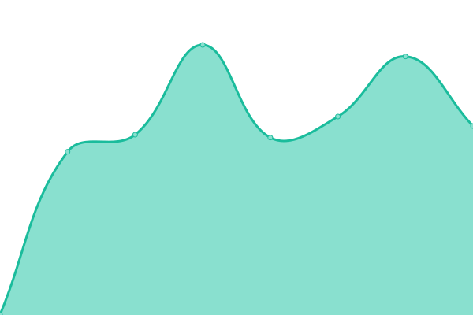
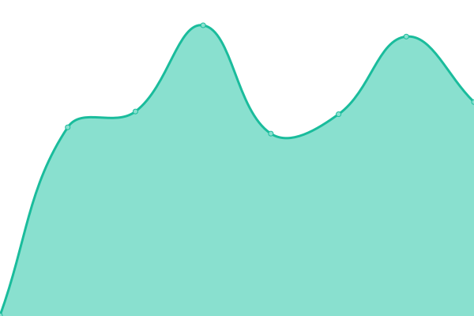
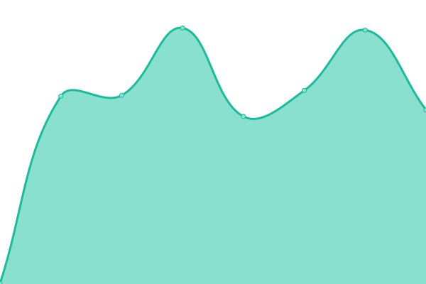
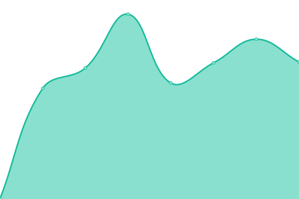
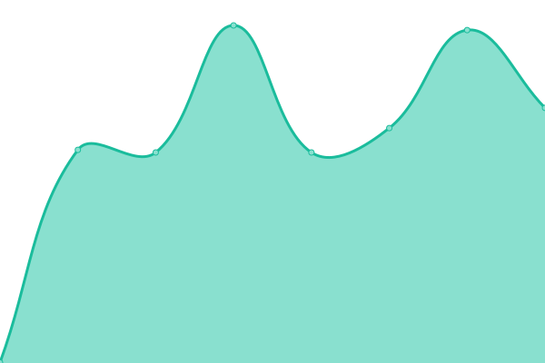
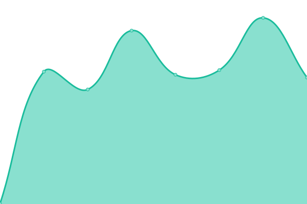
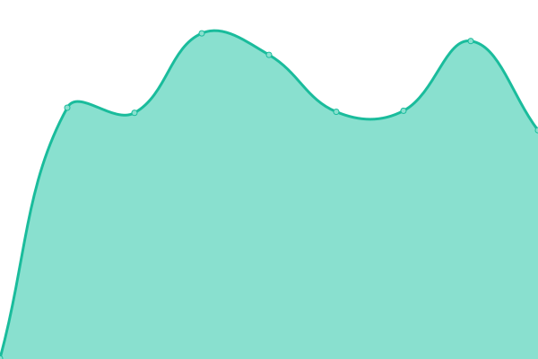

# [📈 Live Status](https://thundersquared.github.io/upptime): <!--live status--> **🟩 All systems operational**

This repository contains the open-source uptime monitor and status page for [thundersquared](https://thundersquared.com/), powered by [Upptime](https://github.com/upptime/upptime).

With [Upptime](https://upptime.js.org), you can get your own unlimited and free uptime monitor and status page, powered entirely by a GitHub repository. We use [Issues](https://github.com/thundersquared/upptime/issues) as incident reports, [Actions](https://github.com/thundersquared/upptime/actions) as uptime monitors, and [Pages](https://thundersquared.github.io/upptime) for the status page.

<!--start: status pages-->
<!-- This summary is generated by Upptime (https://github.com/upptime/upptime) -->
<!-- Do not edit this manually, your changes will be overwritten -->
<!-- prettier-ignore -->
| URL | Status | History | Response Time | Uptime |
| --- | ------ | ------- | ------------- | ------ |
|  [thundersquared](https://thundersquared.com/) | 🟩 Up | [thundersquared.yml](https://github.com/thundersquared/upptime/commits/HEAD/history/thundersquared.yml) | 

 840ms
     
 | 

<a href="https://thundersquared.github.io/upptime/history/thundersquared">100.00%</a>
    

|  web1 | 🟩 Up | [web1.yml](https://github.com/thundersquared/upptime/commits/HEAD/history/web1.yml) | 

 569ms
     
 | 

<a href="https://thundersquared.github.io/upptime/history/web1">100.00%</a>
    

|  web2 | 🟩 Up | [web2.yml](https://github.com/thundersquared/upptime/commits/HEAD/history/web2.yml) | 

 477ms
     
 | 

<a href="https://thundersquared.github.io/upptime/history/web2">100.00%</a>
    

|  web4 | 🟩 Up | [web4.yml](https://github.com/thundersquared/upptime/commits/HEAD/history/web4.yml) | 

 509ms
     
 | 

<a href="https://thundersquared.github.io/upptime/history/web4">100.00%</a>
    

|  web5 | 🟩 Up | [web5.yml](https://github.com/thundersquared/upptime/commits/HEAD/history/web5.yml) | 

 542ms
     
 | 

<a href="https://thundersquared.github.io/upptime/history/web5">100.00%</a>
    

|  web6 | 🟩 Up | [web6.yml](https://github.com/thundersquared/upptime/commits/HEAD/history/web6.yml) | 

 556ms
     
 | 

<a href="https://thundersquared.github.io/upptime/history/web6">100.00%</a>
    

|  web7 | 🟩 Up | [web7.yml](https://github.com/thundersquared/upptime/commits/HEAD/history/web7.yml) | 

 508ms
     
 | 

<a href="https://thundersquared.github.io/upptime/history/web7">100.00%</a>
    

<!--end: status pages-->

[**Visit our status website →**](https://thundersquared.github.io/upptime)

## 📄 License

- Powered by: [Upptime](https://github.com/upptime/upptime)
- Code: [MIT](./LICENSE) © [Anand Chowdhary](https://anandchowdhary.com), supported by [Pabio](https://pabio.com)
- Data in the `./history` directory: [Open Database License](https://opendatacommons.org/licenses/odbl/1-0/)
